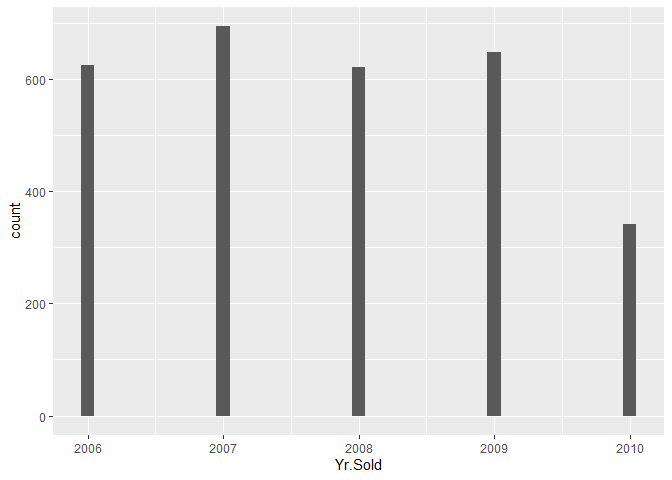
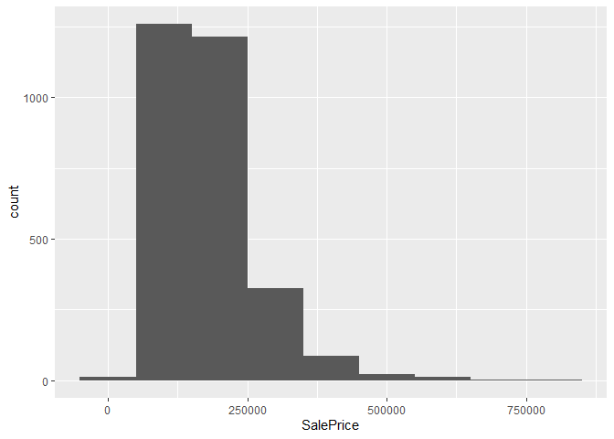
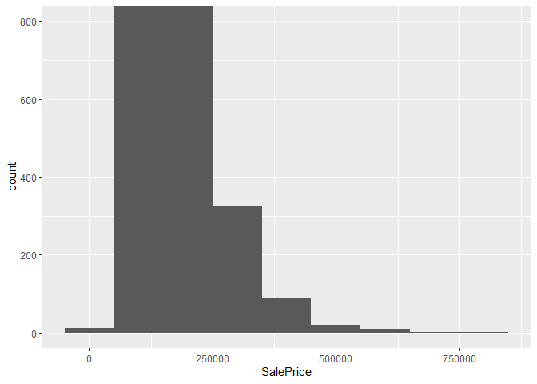
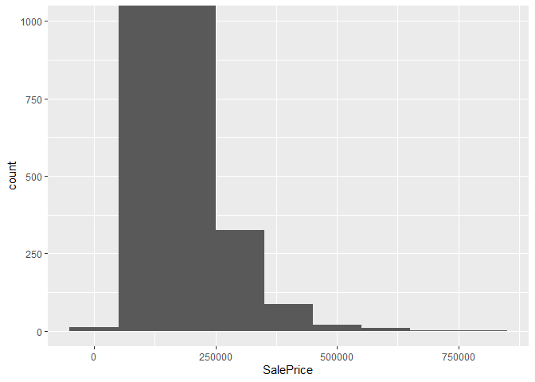
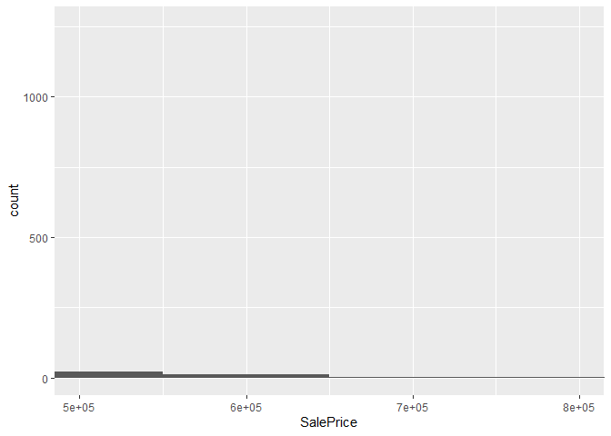
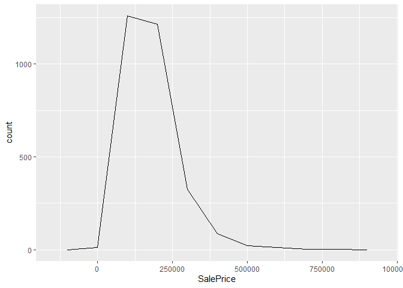
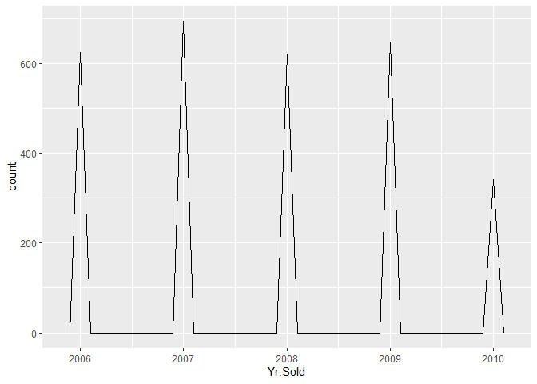
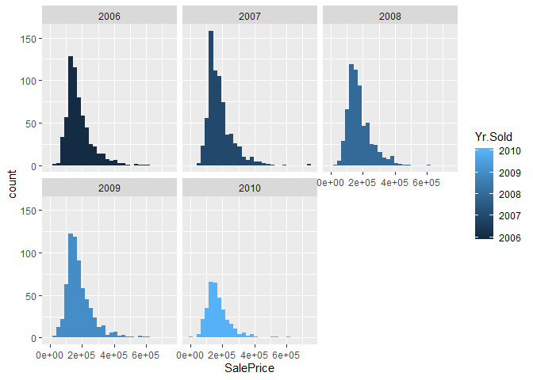
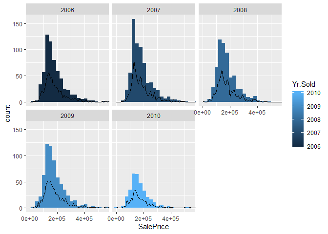
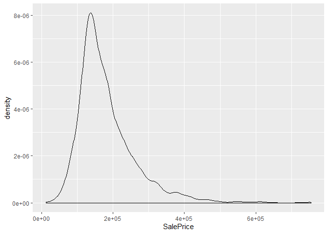

# Read in data

```r
knitr::opts_chunk$set(echo = TRUE)
ames <- read.csv("https://norcalbiostat.netlify.com/data/ames.csv", header=TRUE)
```


# Do data management 

```r
library(tidyverse)
```

```
## -- Attaching packages -------------------------------------------------------------------------------- tidyverse 1.2.1 --
```

```
## v ggplot2 3.2.1     v purrr   0.3.2
## v tibble  2.1.3     v dplyr   0.8.3
## v tidyr   0.8.3     v stringr 1.4.0
## v readr   1.3.1     v forcats 0.4.0
```

```
## -- Conflicts ----------------------------------------------------------------------------------- tidyverse_conflicts() --
## x dplyr::filter() masks stats::filter()
## x dplyr::lag()    masks stats::lag()
```


```r
str(ames)
```

```
## 'data.frame':	2930 obs. of  82 variables:
##  $ Order          : int  1 2 3 4 5 6 7 8 9 10 ...
##  $ PID            : int  526301100 526350040 526351010 526353030 527105010 527105030 527127150 527145080 527146030 527162130 ...
##  $ MS.SubClass    : int  20 20 20 20 60 60 120 120 120 60 ...
##  $ MS.Zoning      : Factor w/ 7 levels "A (agr)","C (all)",..: 6 5 6 6 6 6 6 6 6 6 ...
##  $ Lot.Frontage   : int  141 80 81 93 74 78 41 43 39 60 ...
##  $ Lot.Area       : int  31770 11622 14267 11160 13830 9978 4920 5005 5389 7500 ...
##  $ Street         : Factor w/ 2 levels "Grvl","Pave": 2 2 2 2 2 2 2 2 2 2 ...
##  $ Alley          : Factor w/ 2 levels "Grvl","Pave": NA NA NA NA NA NA NA NA NA NA ...
##  $ Lot.Shape      : Factor w/ 4 levels "IR1","IR2","IR3",..: 1 4 1 4 1 1 4 1 1 4 ...
##  $ Land.Contour   : Factor w/ 4 levels "Bnk","HLS","Low",..: 4 4 4 4 4 4 4 2 4 4 ...
##  $ Utilities      : Factor w/ 3 levels "AllPub","NoSeWa",..: 1 1 1 1 1 1 1 1 1 1 ...
##  $ Lot.Config     : Factor w/ 5 levels "Corner","CulDSac",..: 1 5 1 1 5 5 5 5 5 5 ...
##  $ Land.Slope     : Factor w/ 3 levels "Gtl","Mod","Sev": 1 1 1 1 1 1 1 1 1 1 ...
##  $ Neighborhood   : Factor w/ 28 levels "Blmngtn","Blueste",..: 16 16 16 16 9 9 25 25 25 9 ...
##  $ Condition.1    : Factor w/ 9 levels "Artery","Feedr",..: 3 2 3 3 3 3 3 3 3 3 ...
##  $ Condition.2    : Factor w/ 8 levels "Artery","Feedr",..: 3 3 3 3 3 3 3 3 3 3 ...
##  $ Bldg.Type      : Factor w/ 5 levels "1Fam","2fmCon",..: 1 1 1 1 1 1 5 5 5 1 ...
##  $ House.Style    : Factor w/ 8 levels "1.5Fin","1.5Unf",..: 3 3 3 3 6 6 3 3 3 6 ...
##  $ Overall.Qual   : int  6 5 6 7 5 6 8 8 8 7 ...
##  $ Overall.Cond   : int  5 6 6 5 5 6 5 5 5 5 ...
##  $ Year.Built     : int  1960 1961 1958 1968 1997 1998 2001 1992 1995 1999 ...
##  $ Year.Remod.Add : int  1960 1961 1958 1968 1998 1998 2001 1992 1996 1999 ...
##  $ Roof.Style     : Factor w/ 6 levels "Flat","Gable",..: 4 2 4 4 2 2 2 2 2 2 ...
##  $ Roof.Matl      : Factor w/ 8 levels "ClyTile","CompShg",..: 2 2 2 2 2 2 2 2 2 2 ...
##  $ Exterior.1st   : Factor w/ 16 levels "AsbShng","AsphShn",..: 4 14 15 4 14 14 6 7 6 14 ...
##  $ Exterior.2nd   : Factor w/ 17 levels "AsbShng","AsphShn",..: 11 15 16 4 15 15 6 7 6 15 ...
##  $ Mas.Vnr.Type   : Factor w/ 6 levels "","BrkCmn","BrkFace",..: 6 5 3 5 5 3 5 5 5 5 ...
##  $ Mas.Vnr.Area   : int  112 0 108 0 0 20 0 0 0 0 ...
##  $ Exter.Qual     : Factor w/ 4 levels "Ex","Fa","Gd",..: 4 4 4 3 4 4 3 3 3 4 ...
##  $ Exter.Cond     : Factor w/ 5 levels "Ex","Fa","Gd",..: 5 5 5 5 5 5 5 5 5 5 ...
##  $ Foundation     : Factor w/ 6 levels "BrkTil","CBlock",..: 2 2 2 2 3 3 3 3 3 3 ...
##  $ Bsmt.Qual      : Factor w/ 6 levels "","Ex","Fa","Gd",..: 6 6 6 6 4 6 4 4 4 6 ...
##  $ Bsmt.Cond      : Factor w/ 6 levels "","Ex","Fa","Gd",..: 4 6 6 6 6 6 6 6 6 6 ...
##  $ Bsmt.Exposure  : Factor w/ 5 levels "","Av","Gd","Mn",..: 3 5 5 5 5 5 4 5 5 5 ...
##  $ BsmtFin.Type.1 : Factor w/ 7 levels "","ALQ","BLQ",..: 3 6 2 2 4 4 4 2 4 7 ...
##  $ BsmtFin.SF.1   : int  639 468 923 1065 791 602 616 263 1180 0 ...
##  $ BsmtFin.Type.2 : Factor w/ 7 levels "","ALQ","BLQ",..: 7 5 7 7 7 7 7 7 7 7 ...
##  $ BsmtFin.SF.2   : int  0 144 0 0 0 0 0 0 0 0 ...
##  $ Bsmt.Unf.SF    : int  441 270 406 1045 137 324 722 1017 415 994 ...
##  $ Total.Bsmt.SF  : int  1080 882 1329 2110 928 926 1338 1280 1595 994 ...
##  $ Heating        : Factor w/ 6 levels "Floor","GasA",..: 2 2 2 2 2 2 2 2 2 2 ...
##  $ Heating.QC     : Factor w/ 5 levels "Ex","Fa","Gd",..: 2 5 5 1 3 1 1 1 1 3 ...
##  $ Central.Air    : Factor w/ 2 levels "N","Y": 2 2 2 2 2 2 2 2 2 2 ...
##  $ Electrical     : Factor w/ 6 levels "","FuseA","FuseF",..: 6 6 6 6 6 6 6 6 6 6 ...
##  $ X1st.Flr.SF    : int  1656 896 1329 2110 928 926 1338 1280 1616 1028 ...
##  $ X2nd.Flr.SF    : int  0 0 0 0 701 678 0 0 0 776 ...
##  $ Low.Qual.Fin.SF: int  0 0 0 0 0 0 0 0 0 0 ...
##  $ Gr.Liv.Area    : int  1656 896 1329 2110 1629 1604 1338 1280 1616 1804 ...
##  $ Bsmt.Full.Bath : int  1 0 0 1 0 0 1 0 1 0 ...
##  $ Bsmt.Half.Bath : int  0 0 0 0 0 0 0 0 0 0 ...
##  $ Full.Bath      : int  1 1 1 2 2 2 2 2 2 2 ...
##  $ Half.Bath      : int  0 0 1 1 1 1 0 0 0 1 ...
##  $ Bedroom.AbvGr  : int  3 2 3 3 3 3 2 2 2 3 ...
##  $ Kitchen.AbvGr  : int  1 1 1 1 1 1 1 1 1 1 ...
##  $ Kitchen.Qual   : Factor w/ 5 levels "Ex","Fa","Gd",..: 5 5 3 1 5 3 3 3 3 3 ...
##  $ TotRms.AbvGrd  : int  7 5 6 8 6 7 6 5 5 7 ...
##  $ Functional     : Factor w/ 8 levels "Maj1","Maj2",..: 8 8 8 8 8 8 8 8 8 8 ...
##  $ Fireplaces     : int  2 0 0 2 1 1 0 0 1 1 ...
##  $ Fireplace.Qu   : Factor w/ 5 levels "Ex","Fa","Gd",..: 3 NA NA 5 5 3 NA NA 5 5 ...
##  $ Garage.Type    : Factor w/ 6 levels "2Types","Attchd",..: 2 2 2 2 2 2 2 2 2 2 ...
##  $ Garage.Yr.Blt  : int  1960 1961 1958 1968 1997 1998 2001 1992 1995 1999 ...
##  $ Garage.Finish  : Factor w/ 4 levels "","Fin","RFn",..: 2 4 4 2 2 2 2 3 3 2 ...
##  $ Garage.Cars    : int  2 1 1 2 2 2 2 2 2 2 ...
##  $ Garage.Area    : int  528 730 312 522 482 470 582 506 608 442 ...
##  $ Garage.Qual    : Factor w/ 6 levels "","Ex","Fa","Gd",..: 6 6 6 6 6 6 6 6 6 6 ...
##  $ Garage.Cond    : Factor w/ 6 levels "","Ex","Fa","Gd",..: 6 6 6 6 6 6 6 6 6 6 ...
##  $ Paved.Drive    : Factor w/ 3 levels "N","P","Y": 2 3 3 3 3 3 3 3 3 3 ...
##  $ Wood.Deck.SF   : int  210 140 393 0 212 360 0 0 237 140 ...
##  $ Open.Porch.SF  : int  62 0 36 0 34 36 0 82 152 60 ...
##  $ Enclosed.Porch : int  0 0 0 0 0 0 170 0 0 0 ...
##  $ X3Ssn.Porch    : int  0 0 0 0 0 0 0 0 0 0 ...
##  $ Screen.Porch   : int  0 120 0 0 0 0 0 144 0 0 ...
##  $ Pool.Area      : int  0 0 0 0 0 0 0 0 0 0 ...
##  $ Pool.QC        : Factor w/ 4 levels "Ex","Fa","Gd",..: NA NA NA NA NA NA NA NA NA NA ...
##  $ Fence          : Factor w/ 4 levels "GdPrv","GdWo",..: NA 3 NA NA 3 NA NA NA NA NA ...
##  $ Misc.Feature   : Factor w/ 5 levels "Elev","Gar2",..: NA NA 2 NA NA NA NA NA NA NA ...
##  $ Misc.Val       : int  0 0 12500 0 0 0 0 0 0 0 ...
##  $ Mo.Sold        : int  5 6 6 4 3 6 4 1 3 6 ...
##  $ Yr.Sold        : int  2010 2010 2010 2010 2010 2010 2010 2010 2010 2010 ...
##  $ Sale.Type      : Factor w/ 10 levels "COD","Con","ConLD",..: 10 10 10 10 10 10 10 10 10 10 ...
##  $ Sale.Condition : Factor w/ 6 levels "Abnorml","AdjLand",..: 5 5 5 5 5 5 5 5 5 5 ...
##  $ SalePrice      : int  215000 105000 172000 244000 189900 195500 213500 191500 236500 189000 ...
```


```r
summary(ames$House.Style)
```

```
## 1.5Fin 1.5Unf 1Story 2.5Fin 2.5Unf 2Story SFoyer   SLvl 
##    314     19   1481      8     24    873     83    128
```

```r
str(ames$House.Style)
```

```
##  Factor w/ 8 levels "1.5Fin","1.5Unf",..: 3 3 3 3 6 6 3 3 3 6 ...
```


```r
summary(ames$Yr.Sold)
```

```
##    Min. 1st Qu.  Median    Mean 3rd Qu.    Max. 
##    2006    2007    2008    2008    2009    2010
```


```r
ggplot(data = ames, mapping = aes(x = Yr.Sold)) +
  geom_histogram(binwidth = 0.1)
```

<!-- -->

I am interested in looking at the trends of the year the house was sold and the sale price. By doing a str on the data set, those two variables are integers. 


```r
ggplot(data = ames, mapping = aes(x = SalePrice)) +
  geom_histogram(binwidth = 100000)
```

<!-- -->
Checking if there are unusual values


```r
ggplot(ames) + 
  geom_histogram(mapping = aes(x = SalePrice), binwidth = 100000) +
  coord_cartesian(ylim = c(0, 800))
```

<!-- -->


```r
ggplot(ames) + 
  geom_histogram(mapping = aes(x = SalePrice), binwidth = 100000) +
  coord_cartesian(ylim = c(0, 1000))
```

<!-- -->


```r
ggplot(ames) + 
  geom_histogram(mapping = aes(x = SalePrice), binwidth = 100000) +
  coord_cartesian(xlim = c(800000, 500000))
```

<!-- -->

I don't think there are any unusual values that need to be removed or coded as missing, but if someone wanted to double check that would be great. 


```r
summary(ames$Yr.Sold)
```

```
##    Min. 1st Qu.  Median    Mean 3rd Qu.    Max. 
##    2006    2007    2008    2008    2009    2010
```


```r
str(ames)
```

```
## 'data.frame':	2930 obs. of  82 variables:
##  $ Order          : int  1 2 3 4 5 6 7 8 9 10 ...
##  $ PID            : int  526301100 526350040 526351010 526353030 527105010 527105030 527127150 527145080 527146030 527162130 ...
##  $ MS.SubClass    : int  20 20 20 20 60 60 120 120 120 60 ...
##  $ MS.Zoning      : Factor w/ 7 levels "A (agr)","C (all)",..: 6 5 6 6 6 6 6 6 6 6 ...
##  $ Lot.Frontage   : int  141 80 81 93 74 78 41 43 39 60 ...
##  $ Lot.Area       : int  31770 11622 14267 11160 13830 9978 4920 5005 5389 7500 ...
##  $ Street         : Factor w/ 2 levels "Grvl","Pave": 2 2 2 2 2 2 2 2 2 2 ...
##  $ Alley          : Factor w/ 2 levels "Grvl","Pave": NA NA NA NA NA NA NA NA NA NA ...
##  $ Lot.Shape      : Factor w/ 4 levels "IR1","IR2","IR3",..: 1 4 1 4 1 1 4 1 1 4 ...
##  $ Land.Contour   : Factor w/ 4 levels "Bnk","HLS","Low",..: 4 4 4 4 4 4 4 2 4 4 ...
##  $ Utilities      : Factor w/ 3 levels "AllPub","NoSeWa",..: 1 1 1 1 1 1 1 1 1 1 ...
##  $ Lot.Config     : Factor w/ 5 levels "Corner","CulDSac",..: 1 5 1 1 5 5 5 5 5 5 ...
##  $ Land.Slope     : Factor w/ 3 levels "Gtl","Mod","Sev": 1 1 1 1 1 1 1 1 1 1 ...
##  $ Neighborhood   : Factor w/ 28 levels "Blmngtn","Blueste",..: 16 16 16 16 9 9 25 25 25 9 ...
##  $ Condition.1    : Factor w/ 9 levels "Artery","Feedr",..: 3 2 3 3 3 3 3 3 3 3 ...
##  $ Condition.2    : Factor w/ 8 levels "Artery","Feedr",..: 3 3 3 3 3 3 3 3 3 3 ...
##  $ Bldg.Type      : Factor w/ 5 levels "1Fam","2fmCon",..: 1 1 1 1 1 1 5 5 5 1 ...
##  $ House.Style    : Factor w/ 8 levels "1.5Fin","1.5Unf",..: 3 3 3 3 6 6 3 3 3 6 ...
##  $ Overall.Qual   : int  6 5 6 7 5 6 8 8 8 7 ...
##  $ Overall.Cond   : int  5 6 6 5 5 6 5 5 5 5 ...
##  $ Year.Built     : int  1960 1961 1958 1968 1997 1998 2001 1992 1995 1999 ...
##  $ Year.Remod.Add : int  1960 1961 1958 1968 1998 1998 2001 1992 1996 1999 ...
##  $ Roof.Style     : Factor w/ 6 levels "Flat","Gable",..: 4 2 4 4 2 2 2 2 2 2 ...
##  $ Roof.Matl      : Factor w/ 8 levels "ClyTile","CompShg",..: 2 2 2 2 2 2 2 2 2 2 ...
##  $ Exterior.1st   : Factor w/ 16 levels "AsbShng","AsphShn",..: 4 14 15 4 14 14 6 7 6 14 ...
##  $ Exterior.2nd   : Factor w/ 17 levels "AsbShng","AsphShn",..: 11 15 16 4 15 15 6 7 6 15 ...
##  $ Mas.Vnr.Type   : Factor w/ 6 levels "","BrkCmn","BrkFace",..: 6 5 3 5 5 3 5 5 5 5 ...
##  $ Mas.Vnr.Area   : int  112 0 108 0 0 20 0 0 0 0 ...
##  $ Exter.Qual     : Factor w/ 4 levels "Ex","Fa","Gd",..: 4 4 4 3 4 4 3 3 3 4 ...
##  $ Exter.Cond     : Factor w/ 5 levels "Ex","Fa","Gd",..: 5 5 5 5 5 5 5 5 5 5 ...
##  $ Foundation     : Factor w/ 6 levels "BrkTil","CBlock",..: 2 2 2 2 3 3 3 3 3 3 ...
##  $ Bsmt.Qual      : Factor w/ 6 levels "","Ex","Fa","Gd",..: 6 6 6 6 4 6 4 4 4 6 ...
##  $ Bsmt.Cond      : Factor w/ 6 levels "","Ex","Fa","Gd",..: 4 6 6 6 6 6 6 6 6 6 ...
##  $ Bsmt.Exposure  : Factor w/ 5 levels "","Av","Gd","Mn",..: 3 5 5 5 5 5 4 5 5 5 ...
##  $ BsmtFin.Type.1 : Factor w/ 7 levels "","ALQ","BLQ",..: 3 6 2 2 4 4 4 2 4 7 ...
##  $ BsmtFin.SF.1   : int  639 468 923 1065 791 602 616 263 1180 0 ...
##  $ BsmtFin.Type.2 : Factor w/ 7 levels "","ALQ","BLQ",..: 7 5 7 7 7 7 7 7 7 7 ...
##  $ BsmtFin.SF.2   : int  0 144 0 0 0 0 0 0 0 0 ...
##  $ Bsmt.Unf.SF    : int  441 270 406 1045 137 324 722 1017 415 994 ...
##  $ Total.Bsmt.SF  : int  1080 882 1329 2110 928 926 1338 1280 1595 994 ...
##  $ Heating        : Factor w/ 6 levels "Floor","GasA",..: 2 2 2 2 2 2 2 2 2 2 ...
##  $ Heating.QC     : Factor w/ 5 levels "Ex","Fa","Gd",..: 2 5 5 1 3 1 1 1 1 3 ...
##  $ Central.Air    : Factor w/ 2 levels "N","Y": 2 2 2 2 2 2 2 2 2 2 ...
##  $ Electrical     : Factor w/ 6 levels "","FuseA","FuseF",..: 6 6 6 6 6 6 6 6 6 6 ...
##  $ X1st.Flr.SF    : int  1656 896 1329 2110 928 926 1338 1280 1616 1028 ...
##  $ X2nd.Flr.SF    : int  0 0 0 0 701 678 0 0 0 776 ...
##  $ Low.Qual.Fin.SF: int  0 0 0 0 0 0 0 0 0 0 ...
##  $ Gr.Liv.Area    : int  1656 896 1329 2110 1629 1604 1338 1280 1616 1804 ...
##  $ Bsmt.Full.Bath : int  1 0 0 1 0 0 1 0 1 0 ...
##  $ Bsmt.Half.Bath : int  0 0 0 0 0 0 0 0 0 0 ...
##  $ Full.Bath      : int  1 1 1 2 2 2 2 2 2 2 ...
##  $ Half.Bath      : int  0 0 1 1 1 1 0 0 0 1 ...
##  $ Bedroom.AbvGr  : int  3 2 3 3 3 3 2 2 2 3 ...
##  $ Kitchen.AbvGr  : int  1 1 1 1 1 1 1 1 1 1 ...
##  $ Kitchen.Qual   : Factor w/ 5 levels "Ex","Fa","Gd",..: 5 5 3 1 5 3 3 3 3 3 ...
##  $ TotRms.AbvGrd  : int  7 5 6 8 6 7 6 5 5 7 ...
##  $ Functional     : Factor w/ 8 levels "Maj1","Maj2",..: 8 8 8 8 8 8 8 8 8 8 ...
##  $ Fireplaces     : int  2 0 0 2 1 1 0 0 1 1 ...
##  $ Fireplace.Qu   : Factor w/ 5 levels "Ex","Fa","Gd",..: 3 NA NA 5 5 3 NA NA 5 5 ...
##  $ Garage.Type    : Factor w/ 6 levels "2Types","Attchd",..: 2 2 2 2 2 2 2 2 2 2 ...
##  $ Garage.Yr.Blt  : int  1960 1961 1958 1968 1997 1998 2001 1992 1995 1999 ...
##  $ Garage.Finish  : Factor w/ 4 levels "","Fin","RFn",..: 2 4 4 2 2 2 2 3 3 2 ...
##  $ Garage.Cars    : int  2 1 1 2 2 2 2 2 2 2 ...
##  $ Garage.Area    : int  528 730 312 522 482 470 582 506 608 442 ...
##  $ Garage.Qual    : Factor w/ 6 levels "","Ex","Fa","Gd",..: 6 6 6 6 6 6 6 6 6 6 ...
##  $ Garage.Cond    : Factor w/ 6 levels "","Ex","Fa","Gd",..: 6 6 6 6 6 6 6 6 6 6 ...
##  $ Paved.Drive    : Factor w/ 3 levels "N","P","Y": 2 3 3 3 3 3 3 3 3 3 ...
##  $ Wood.Deck.SF   : int  210 140 393 0 212 360 0 0 237 140 ...
##  $ Open.Porch.SF  : int  62 0 36 0 34 36 0 82 152 60 ...
##  $ Enclosed.Porch : int  0 0 0 0 0 0 170 0 0 0 ...
##  $ X3Ssn.Porch    : int  0 0 0 0 0 0 0 0 0 0 ...
##  $ Screen.Porch   : int  0 120 0 0 0 0 0 144 0 0 ...
##  $ Pool.Area      : int  0 0 0 0 0 0 0 0 0 0 ...
##  $ Pool.QC        : Factor w/ 4 levels "Ex","Fa","Gd",..: NA NA NA NA NA NA NA NA NA NA ...
##  $ Fence          : Factor w/ 4 levels "GdPrv","GdWo",..: NA 3 NA NA 3 NA NA NA NA NA ...
##  $ Misc.Feature   : Factor w/ 5 levels "Elev","Gar2",..: NA NA 2 NA NA NA NA NA NA NA ...
##  $ Misc.Val       : int  0 0 12500 0 0 0 0 0 0 0 ...
##  $ Mo.Sold        : int  5 6 6 4 3 6 4 1 3 6 ...
##  $ Yr.Sold        : int  2010 2010 2010 2010 2010 2010 2010 2010 2010 2010 ...
##  $ Sale.Type      : Factor w/ 10 levels "COD","Con","ConLD",..: 10 10 10 10 10 10 10 10 10 10 ...
##  $ Sale.Condition : Factor w/ 6 levels "Abnorml","AdjLand",..: 5 5 5 5 5 5 5 5 5 5 ...
##  $ SalePrice      : int  215000 105000 172000 244000 189900 195500 213500 191500 236500 189000 ...
```


```r
ggplot(data = ames, mapping = aes(x = SalePrice, colour = Yr.Sold)) +
  geom_freqpoly(binwidth = 100000)
```

<!-- -->


```r
ggplot(data = ames, mapping = aes(x = Yr.Sold, colour = SalePrice)) +
  geom_freqpoly(binwidth = 0.1)
```

<!-- -->


```r
ggplot(data = ames, mapping = aes(x = SalePrice, colour = Yr.Sold)) +
  geom_freqpoly(binwidth = 100000)
```

<!-- -->


```r
ames %>% group_by(Yr.Sold) %>% 
         summarise(mean=mean(SalePrice), 
                   sd = sd(SalePrice))
```

```
## # A tibble: 5 x 3
##   Yr.Sold    mean     sd
##     <int>   <dbl>  <dbl>
## 1    2006 181762. 82620.
## 2    2007 185138. 82543.
## 3    2008 178842. 75593.
## 4    2009 181405. 80857.
## 5    2010 172598. 74631.
```


Let's see if there is a trend in the year the houses were sold and the sale price. 

```r
ggplot(ames, aes(x=SalePrice, fill=Yr.Sold)) + 
    geom_histogram() + 
    facet_wrap(~Yr.Sold)
```

```
## `stat_bin()` using `bins = 30`. Pick better value with `binwidth`.
```

<!-- -->
I like this set of graphics best so far, but I am still not sure if this is clear on what I am looking at. 


```r
ggplot(ames, aes(x=SalePrice, fill=Yr.Sold)) + 
    geom_histogram() + 
    facet_wrap(~Yr.Sold)+
  geom_freqpoly(binwidth = 10000)+
  coord_cartesian(xlim = c(0, 550000))
```

```
## `stat_bin()` using `bins = 30`. Pick better value with `binwidth`.
```

<!-- -->
I think setting a binwidth is what I want to do to make it more clear, but I am not sure what to set it at. I have played around with different numbers and so far 10,000 looks the best. Any suggestions here?
 

```r
ggplot(ames, aes(x=SalePrice, col=Yr.Sold)) + geom_density()
```

<!-- -->
I don't think this one makes any sense.


# Save clean data

```r
#save(clean, "ames_clean.Rdata")
```


