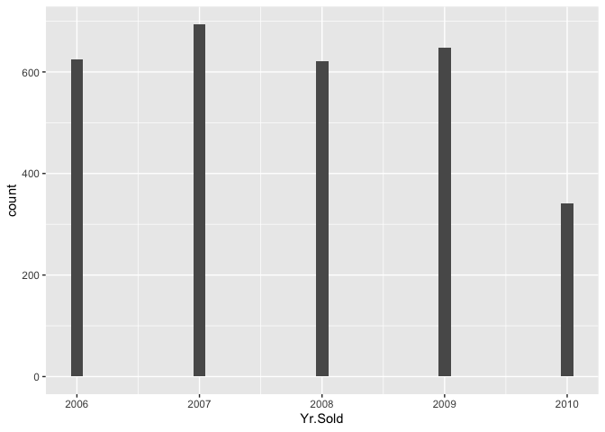
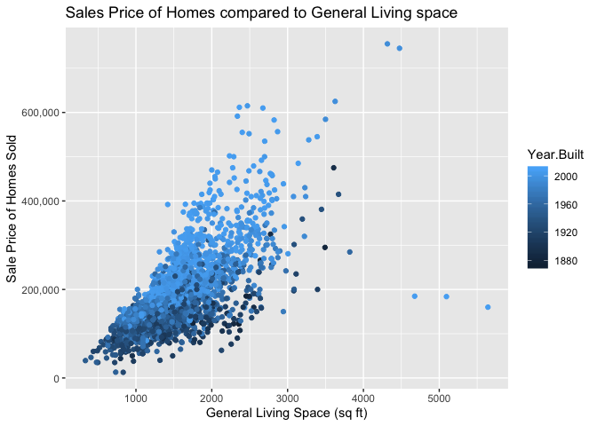
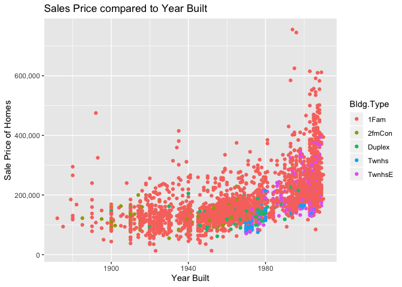

Is there a relationship between the year the house was sold and the sale price?

First, let's look at the distribution of the year the house was sold. 


```r
summary(ames_clean$Yr.Sold)
```

```
##    Min. 1st Qu.  Median    Mean 3rd Qu.    Max. 
##    2006    2007    2008    2008    2009    2010
```


```r
ggplot(data = ames_clean, mapping = aes(x = Yr.Sold)) +
  geom_histogram(binwidth = 0.1)
```

<!-- -->


Looking between 2006 and 2010, it looks like more houses were sold in 2007 (n=694) and the least amount of houses were sold in 2010 (n=341). 


Now to look at sale price. 


```r
summary(ames_clean$SalePrice)
```

```
##    Min. 1st Qu.  Median    Mean 3rd Qu.    Max. 
##   12789  129500  160000  180796  213500  755000
```


```r
ggplot(data = ames_clean, mapping = aes(x = SalePrice)) +
  geom_histogram(binwidth = 100000)
```

<!-- -->

The lowest sale price was $12,789 and the highest was $755,000. The average sale price was $180,796.


```r
ggplot(ames_clean, aes(x=SalePrice, fill=Yr.Sold)) + 
    geom_histogram() + 
    facet_wrap(~Yr.Sold)+
  geom_freqpoly(binwidth = 10000)+  ## im not sure I understand why 
  coord_cartesian(xlim = c(0, 550000))+
  xlab("Sale Price of Homes Sold") +
  ylab("Number of Homes Sold") +
  ggtitle("Sales Price of Homes Sold Between 2006 and 2019") +
  scale_y_continuous(labels = scales::comma) + 
  scale_x_continuous(labels = scales::comma) +
  theme(axis.text.x = element_text(angle=-30))
```

```
## `stat_bin()` using `bins = 30`. Pick better value with `binwidth`.
```

<!-- -->

When looking at year sold and sales price......

(I feel that this might make more sense if I broke these out by year?)


###  Is there a relationship between the price of the hold sold and the lot area?

```r
ggplot(ames_clean, aes(x=Lot.Area, y=SalePrice, color=Year.Built)) +
  geom_point() +
  xlab("Area of Lot (sq ft)") +
  ylab("Sale Price of Homes") +
  ggtitle("Sales Price compared to Lot Area of Homes") +
  scale_y_continuous(labels = scales::comma) 
```

<!-- -->

It seems there is a positive relationship, however this graph shows us some extreme outliers above 150,000 sq ft (assuming sq ft) with respect to the lot area of the home. Most homes are below 25,000 sq ft which is just above 1/2 acre lot size (1 acre = 43,560 sq ft). The expensive homes also seem to be built more recently.

### Is Sales price related to the General Living Area of homes sold?


```r
ggplot(ames_clean, aes(x=Gr.Liv.Area, y=SalePrice, color=Year.Built)) +
  geom_point() +
  xlab("General Living Space (sq ft)") +
  ylab("Sale Price of Homes Sold") +
  ggtitle("Sales Price of Homes compared to General Living space") +
  scale_y_continuous(labels = scales::comma) 
```

<!-- -->

There seems to be a clear positive relationship with amount of general living space within a home and the sales price of the home when it is sold, Also we can see the visual trend of newer homes fetching a higher sales price. 

### Does this trend still hold up visually when we break out the data by the type of home?

```r
ggplot(ames_clean, aes(x=Gr.Liv.Area, y=SalePrice, color=Year.Built)) +
  geom_point() +
  facet_wrap(~Bldg.Type)+
  xlab("Area of Lot (sq ft)") +
  ylab("Sale Price of Homes") +
  ggtitle("Sales Price compared to Lot Area of Homes") +
  scale_y_continuous(labels = scales::comma) +
  theme(axis.text.x = element_text(angle=-30))
```

<!-- -->

For all cases it seems that General living space is positively related to the sales price of homes. However, it is difficult to understand the influence year built has on the price of homes when visualized a color gradient compared to a continuous axis, so lets look at the data a little differntly


## Is there a relationship between the year the home was built and the sales price?

```r
ggplot(ames_clean, aes(x=Year.Built, y=SalePrice, color=Bldg.Type)) +
  geom_point() +
  xlab("Year Built") +
  ylab("Sale Price of Homes") +
  ggtitle("Sales Price compared to Year Built") +
  scale_y_continuous(labels = scales::comma)
```

<!-- -->

It looks like we have a positive relationship between the year the home was built and the sales price of the home.  We have colored the home types but it is hard to see if the trend holds for each type so lets break it out with facet wrapping.

### Does the trend hold for each building type?


```r
ggplot(ames_clean, aes(x=Year.Built, y=SalePrice, color=Bldg.Type)) +
  geom_point() +
  facet_wrap(~Bldg.Type) +
  xlab("Year Built") +
  ylab("Sale Price of Homes") +
  ggtitle("Sales Price compared to Year Built") +
  scale_y_continuous(labels = scales::comma)
```

<!-- -->

```r
  scale_y_continuous(labels = scales::comma)
```

```
## <ScaleContinuousPosition>
##  Range:  
##  Limits:    0 --    1
```

The positive relationship between year build and the sales price of the home seems to hole for 1Fam, Twnhs, TwnHsE, and MAYBE for duplex but its hard to see, 2fmCon type looks to be relatively flat.

### The story so far... 
From this point we a few potential relationships to explore stastically to make accurate predictions regarding the potential sales price of homes based on the year they were built, the type of home it is, the general living space and lot area of the homes to be sold.
